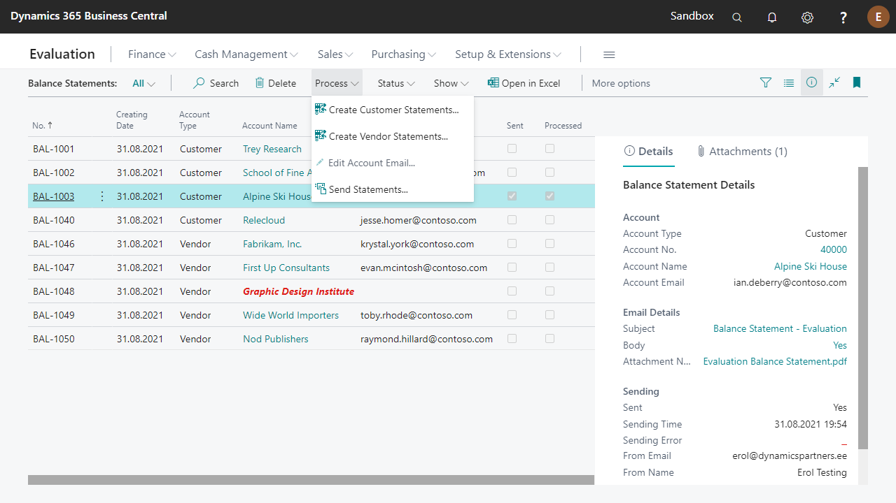
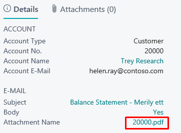

---
---
# Balance Statements - User Guide

Balance Statement functionality allows user to send Balance Statement information to customers or vendors and track their confirmations.

 

## Verify Balance Statement Installation
Open **Extension Management** and check if extension named ‘Balance Statement’ is installed. If not, please find and install it from <a href="https://appsource.microsoft.com/en-us/product/dynamics-365-business-central/PUBID.estonian_dynamics_partners%7CAID.balance-statements%7CPAPPID.2c6e9797-3574-4828-b075-ef340322f94c" target="_blank">AppSource</a> or contact your partner.

 

## Setup
**Open Balance Statements Setup.**

|Field|Value|
|-|-|
|Balance Statement Nos.|Enter new number series you want to use for Balance Statements.|
|Customer Email Layout Code|CUST-EMAIL-by default, but user can modify for company needs.|
|Vendor Email Layout Code|VEND-EMAIL by default, but user can modify for company needs.|
  
 

## Balance Statements 
Open **Balance Statements**.

## How to create Customer/Vendor Statements

_The creation process of customer and vendor balance statements is identical._
Click **Process -> Create Customer/Vendor Statements**

|Field|Value|
|-|-|
|Balance Date|The balance (standing) date.|
|Returning Date|The date user wants Customer/Vendor response.|
|Print In LCY|Specifies if outstanding amount is shown converted to Local Currency only or for each currency separately.|
|Issued By|If specified selected employees information will be added to the signature.|
 
Click **OK** to create statements.

Statements in red mean they are missing Account Email (or have some other error that makes them not sendable).
**You can add/change Account Email with action "Edit Account Email..."** and also save it to customer/vendor card (_exept statements with status Processed_).  

On the factbox user can open PDF of the statement:

 

You can change the design of PDF file and email message body on page **Report Layout Selection**:

|**Report ID**|**Report Name**|
|-|-|
|24012100|Customer - Balance Statement|
|24012101|Vendor - Balance Statement|

 

## How to Send Statements
Before seding the statements, please make sure **SMTP Mail Setup** has been configured.

Click **Process-> Send Statements**

|Field|Value|
|-|-|
|**Email Addressses:**||
|From Email|Enter e-mail from which statements will be sent. It depeneds on your SMTP server setup if you are required to use address from **SMTP Mail Setup** or you can use a different address.|
|Test To|If specified, this address is used instead of Account Email. Can be used for testing.|
|**Filters:**||
|No.|By default current balance statement is filtered. To send all the statements remove the filter for this field.|

Click **OK** to send the statements.

 

## Set Statements Status to Processed
After the feedback from your business partners, you can attach **Notes** to the statements and mark statements as **Processed**.

For more information, please contact one of the partners:  
<a href="http://www.dynamicspartners.ee/" target="_blank">www.dynamicspartners.ee</a>
